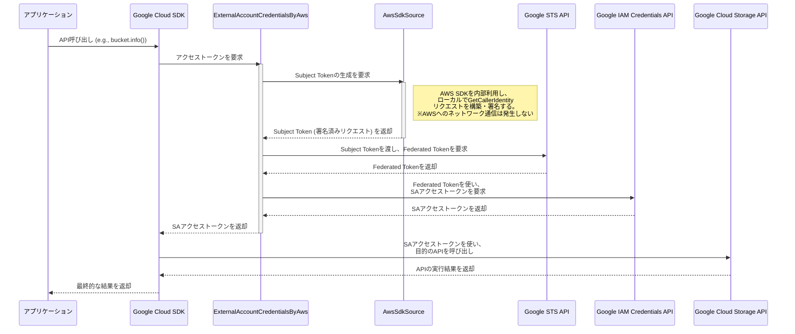

# PHPでAWS ECSからGoogle Cloudに認証する

いつの日もService Accountの認証をService Account Keyを使って行うのはキーの漏洩のリスクなどがつきまといます。
この記事ではWorkload Identity連携[^workload-identity]を使用してAWSのECSからGoogle Cloudに認証を行います。
PHPを使わざるを得ない状況のためPHPで実装していきます。Node.jsが使える環境であれば参考資料であげた各サイトに実装例があります。

:::note info

* この記事は人の手で書かれています
* AIに校正をお願いし人手で修正しています
* コードはAIが生成したものをリファクタリングし、動作確認したものを使用しています

:::

記事の検証用のリポジトリは以下になります。記事中のコードやDockerイメージを格納しています。

https://github.com/k-kojima-yumemi/php-ecs-to-google-cloud

## 参考資料

* https://cloud.google.com/iam/docs/workload-identity-federation-with-other-clouds?hl=ja
    * Workload Identity連携の基本が全て載ってます。とにかくこの通りに設定すれば大丈夫です。
    * EC2から実行するのであればこの記事で事足ります。
* https://zenn.dev/1mono2/articles/1fd85d17e862e3
    * ECSからWorkload Identity連携している記事。 `google-auth-library-nodejs` を使用した実装をしている。
* https://github.com/googleapis/google-auth-library-nodejs/tree/main?tab=readme-ov-file#accessing-resources-from-aws-using-a-custom-aws-security-credentials-supplier
    * `google-auth-library-nodejs` でのAWSからの認証を行うためのコード例が載っている。
* https://zenn.dev/10q89s/articles/aws-to-google-workload-identity#ecs-fargate%E3%82%92%E4%BD%BF%E3%81%86%E5%A0%B4%E5%90%88%E3%81%AE%E6%9B%B8%E3%81%8D%E6%96%B9
    * こちらもECSからWorkload Identity連携している記事。ECS特有の認証エンドポイントに対応した内容。

[^ecs-iam]: https://docs.aws.amazon.com/ja_jp/AmazonECS/latest/developerguide/security-iam-roles.html
[^firebase-issue]: https://github.com/kreait/firebase-php/issues/978
[^workload-identity]: https://cloud.google.com/iam/docs/workload-identity-federation?hl=ja
[^service-account-key]: https://cloud.google.com/iam/docs/keys-create-delete?hl=ja
[^imds]: https://docs.aws.amazon.com/ja_jp/AWSEC2/latest/UserGuide/instancedata-data-retrieval.html
[^subject-token]: https://zenn.dev/takamin55/articles/53d732b081ba66 など参照

## 検証環境

| Name                | Version |
|---------------------|---------|
| PHP                 | 8.4.10  |
| aws/aws-sdk-php     | 3.352.5 |
| google/auth         | 1.47.1  |
| kreait/firebase-php | 7.21.1  |

# Google CloudでのWorkload Identity周りのリソース作成

コンソールから、CLIから、Terraformからなどいろいろな設定手段がありますが、今回はTerraformでの実施例を記載します。
参考資料内にさまざまな方法での設定例があるので参考にしてください。

今回、Service Account Key[^service-account-key]を撲滅するための実施のため、Service Accountの権限借用でリソースへのアクセス許可をします。
この方法ではもともとあったService Accountに付与されている権限を使い回すことができるため、Service Accountベースの権限設計をそのまま活かせます。
詳しくは[こちら](https://cloud.google.com/iam/docs/workload-identity-federation?hl=ja#access_management)を参照してください。
現状はリソースへの直接アクセスが可能なので、こちらの方法ではService Accountが不要であり意図しないキーの発行などが防げます。

## TerraformでのWorkload Identityリソースの作成

```hcl
locals {
  pool_id     = "aws-openid"
  provider_id = "token-aws"
}

resource "google_iam_workload_identity_pool" "pool" {
  workload_identity_pool_id = local.pool_id
  description               = "AWS OpenID Connection"
  display_name              = local.pool_id
  timeouts {}
}

resource "google_iam_workload_identity_pool_provider" "aws_provider" {
  workload_identity_pool_id          = google_iam_workload_identity_pool.pool.workload_identity_pool_id
  workload_identity_pool_provider_id = local.provider_id
  display_name                       = "AWS Identity Provider"
  disabled                           = false
  aws {
    account_id = local.account_id
  }
  attribute_mapping = {
    "google.subject"          = "assertion.arn"
    "attribute.account"       = "assertion.account"
    "attribute.aws_role"      = <<-EOT
      assertion.arn.contains("assumed-role") ? assertion.arn.extract("{account_arn}assumed-role/") + "assumed-role/" + assertion.arn.extract("assumed-role/{role_name}/") : assertion.arn
      EOT
    "attribute.aws_role_name" = "assertion.arn.extract('assumed-role/{role}/')"
  }
  timeouts {}
}
```

google_iam_workload_identity_pool_providerで、awsブロックがサポートされています。

## Service Accountの権限借用設定

権限を借用するにはまず、Service AccountにWorkload Identityからアクセスするための権限を付与します。

```hcl
locals {
  app_name = "app_name"
  iam_name = "iam_role_name"
}

resource "google_service_account" "firebase" {
  account_id   = local.app_name
  display_name = local.app_name
}

resource "google_service_account_iam_binding" "allow_aws" {
  service_account_id = google_service_account.firebase.name
  role               = "roles/iam.workloadIdentityUser"
  members = [
    "principalSet://iam.googleapis.com/${google_iam_workload_identity_pool_provider.aws_provider.name}/attribute.aws_role_name/${locals.iam_name}"
  ]
}
```

attributeとしてaws_role_nameを使用していますが、この辺りは適宜調整して下さい。
ECSの場合、assertion.arnに入るのは `arn:aws:sts::<account_id>:assumed-role/<role_name>/<ecs_task_id>` の形式になります。
`arn:aws:iam::<account_id>:role/<role_name>` の形式ではないので注意が必要です。

Service Accountにリソースに対する権限を付与すると、Workload Identity認証でそのリソースにアクセスできるようになります。

## 認証情報の構成ファイルの作成

https://cloud.google.com/iam/docs/workload-identity-federation-with-other-clouds?hl=ja#create-cred-config
の通り、認証情報の構成ファイルを作成してください。
AWS IMDSv2[^imds]の使用はどちらでも問題ありません。
Service Accountの権限借用をするには該当のService Accountの指定を忘れずに行ってください。

以下のようなJSONファイルが得られます。

```json
{
  "universe_domain": "googleapis.com",
  "type": "external_account",
  "audience": "//iam.googleapis.com/projects/<project_id>/locations/global/workloadIdentityPools/aws-openid/providers/token-aws",
  "subject_token_type": "urn:ietf:params:aws:token-type:aws4_request",
  "service_account_impersonation_url": "https://iamcredentials.googleapis.com/v1/projects/-/serviceAccounts/<service_account_email>:generateAccessToken",
  "token_url": "https://sts.googleapis.com/v1/token",
  "credential_source": {
    "environment_id": "aws1",
    "region_url": "http://169.254.169.254/latest/meta-data/placement/availability-zone",
    "url": "http://169.254.169.254/latest/meta-data/iam/security-credentials",
    "regional_cred_verification_url": "https://sts.{region}.amazonaws.com?Action=GetCallerIdentity&Version=2011-06-15"
  }
}
```

このファイルには秘密鍵が含まれていないので、シークレットとしては扱う必要ありません。
プロジェクトIDやサービスアカウント名が含まれるため、そこまで保護する場合には注意してください。
社内GitHubなどもともとある程度閲覧者が限られている状況であればGitHubにコミットしても問題ないかと思います。

こちらのファイルを、ECSのプロジェクトからアクセスできる位置に配置しておきます。
DockerfileでCOPYしてもいいですし、文字列として環境変数に含めても問題ありません。手元で試すならマウントするのがいいと思います。

:::note warn
一般的にはこちらのファイルの場所を `GOOGLE_APPLICATION_CREDENTIALS`
の環境変数として設定することが必要ですが、今回はECSからアクセスするためのコードを記述するため不要です。
EC2からアクセスするのであれば `GOOGLE_APPLICATION_CREDENTIALS` の指定で問題なく動作します。
:::

# PHPからのGoogle Cloud SDKを用いたアクセス

デフォルトのSDKの実装(subjectTokenFetcherとしてAwsNativeSource.phpを使用)では、「認証情報の構成ファイルの作成」で記述されている
`region_url` や `url` にアクセスします。
ECS環境では `169.254.170.2$AWS_CONTAINER_CREDENTIALS_RELATIVE_URI` のURLで認証情報を取得するため[^ecs-iam]、 JSONに記載されているURLはECS環境では使用できません。
Google Cloud SDKのPHP実装はこのECS独自の仕組みに対応していないため、そのままではAWSの認証情報を取得できず、エラーとなってしまいます。
そのため独自に記述した認証用のコードを使用してGoogle Cloudの各種APIを呼び出すようにします。

参考資料で紹介したNode.jsでの例でも、認証用のコードを作成しそちらを使用してAPIを呼び出しています。

## 認証用のコード

2つのクラスを作成します。
以下のフローに沿ってAPI呼び出しが行われるようになります。



このフローで登場するSubject Token[^subject-token]は、AWSの認証情報から生成される署名済みリクエストのことです。Google STS APIはこれを検証し、Google Cloud内で一時的に利用できるFederated Tokenを発行します。最終的にこのFederated Tokenを使って、権限を借用したいサービスアカウントのアクセストークンを取得します。

### `ExternalAccountCredentialsByAws.php`

https://github.com/googleapis/google-auth-library-php/blob/v1.47.1/src/Credentials/ExternalAccountCredentials.php

を模したコードになります。
audienceやscope, subjectTokenFetcherを管理しているクラスになります。

```php
<?php

declare(strict_types=1);

use Google\Auth\FetchAuthTokenInterface;
use Google\Auth\GetQuotaProjectInterface;
use Google\Auth\GetUniverseDomainInterface;
use Google\Auth\HttpHandler\HttpClientCache;
use Google\Auth\HttpHandler\HttpHandlerFactory;
use Google\Auth\OAuth2;
use Google\Auth\ProjectIdProviderInterface;
use Google\Auth\UpdateMetadataInterface;
use GuzzleHttp\Psr7\Request;
use InvalidArgumentException;
use Override;

class ExternalAccountCredentialsByAws implements
    FetchAuthTokenInterface,
    UpdateMetadataInterface,
    GetQuotaProjectInterface,
    GetUniverseDomainInterface,
    ProjectIdProviderInterface
{

    private const string EXTERNAL_ACCOUNT_TYPE = 'external_account';
    private const string CLOUD_RESOURCE_MANAGER_URL = 'https://cloudresourcemanager.UNIVERSE_DOMAIN/v1/projects/%s';

    private OAuth2 $auth;
    private ?string $quotaProject = null;
    private ?string $serviceAccountImpersonationUrl = null;
    private ?string $workforcePoolUserProject = null;
    private ?string $projectId = null;
    /** @var array|null */
    private ?array $lastImpersonatedAccessToken = null;
    private string $universeDomain;

    /**
     * @param string|string[]|null $scope
     * @param array $jsonKey
     */
    public function __construct(array|string|null $scope, array $jsonKey)
    {
        if (!array_key_exists('type', $jsonKey)) {
            throw new InvalidArgumentException('json key is missing the type field');
        }
        if ($jsonKey['type'] !== self::EXTERNAL_ACCOUNT_TYPE) {
            throw new InvalidArgumentException(sprintf('expected "%s" type but received "%s"', self::EXTERNAL_ACCOUNT_TYPE, $jsonKey['type']));
        }
        foreach (['token_url', 'audience', 'subject_token_type', 'credential_source'] as $key) {
            if (!array_key_exists($key, $jsonKey)) {
                throw new InvalidArgumentException("json key is missing the {$key} field");
            }
        }

        $this->serviceAccountImpersonationUrl = $jsonKey['service_account_impersonation_url'] ?? null;
        $this->quotaProject = $jsonKey['quota_project_id'] ?? null;
        $this->workforcePoolUserProject = $jsonKey['workforce_pool_user_project'] ?? null;
        $this->universeDomain = $jsonKey['universe_domain'] ?? GetUniverseDomainInterface::DEFAULT_UNIVERSE_DOMAIN;

        $credentialSource = $jsonKey['credential_source'];
        $aws = $credentialSource['aws'] ?? $credentialSource;
        $regionalCredVerificationUrl = $aws['regional_cred_verification_url'] ?? null;
        if (!$regionalCredVerificationUrl) {
            throw new InvalidArgumentException('credential_source.aws.regional_cred_verification_url is required');
        }
        $region = $aws['region'] ?? null;

        $subjectTokenFetcher = new AwsSdkSource(
            $jsonKey['audience'],
            $regionalCredVerificationUrl,
            $region,
        );

        $this->auth = new OAuth2([
            'tokenCredentialUri' => $jsonKey['token_url'],
            'audience' => $jsonKey['audience'],
            'scope' => $scope,
            'subjectTokenType' => $jsonKey['subject_token_type'],
            'subjectTokenFetcher' => $subjectTokenFetcher,
            'additionalOptions' => $this->workforcePoolUserProject ? ['userProject' => $this->workforcePoolUserProject] : [],
        ]);

        if (!$this->isWorkforcePool() && $this->workforcePoolUserProject) {
            throw new InvalidArgumentException('workforce_pool_user_project should not be set for non-workforce pool credentials.');
        }
    }

    /**
     * Create from jsonKey array or JSON string.
     *
     * @param string|string[]|null $scope
     */
    public static function fromJson(array|string $jsonKeyOrJsonString, array|string|null $scope = null): self
    {
        $jsonKey = is_array($jsonKeyOrJsonString)
            ? $jsonKeyOrJsonString
            : (json_decode($jsonKeyOrJsonString, true) ?: []);
        if (empty($jsonKey)) {
            throw new InvalidArgumentException('Invalid jsonKey: not an array or invalid JSON string');
        }
        return new self($scope ?? 'https://www.googleapis.com/auth/cloud-platform', $jsonKey);
    }

    /**
     * Create from file path to jsonKey.
     *
     * @param string|string[]|null $scope
     */
    public static function fromFile(string $filePath, array|string|null $scope = null): self
    {
        if (!is_file($filePath)) {
            throw new InvalidArgumentException('auth file not found: '.$filePath);
        }
        $content = (string) file_get_contents($filePath);
        $jsonKey = json_decode($content, true);
        if (!is_array($jsonKey)) {
            throw new InvalidArgumentException('auth file is not a valid JSON object: '.$filePath);
        }
        return new self($scope ?? 'https://www.googleapis.com/auth/cloud-platform', $jsonKey);
    }

    #[Override]
    public function fetchAuthToken(?callable $httpHandler = null, array $headers = []): array
    {
        $stsToken = $this->auth->fetchAuthToken($httpHandler, $headers);
        if (isset($this->serviceAccountImpersonationUrl)) {
            return $this->lastImpersonatedAccessToken = $this->getImpersonatedAccessToken($stsToken['access_token'], $httpHandler);
        }
        return $stsToken;
    }

    #[Override]
    public function getCacheKey(): ?string
    {
        $scopeOrAudience = $this->auth->getAudience() ?: $this->auth->getScope();
        return $this->auth->getSubjectTokenFetcher()->getCacheKey().
            '.'.$scopeOrAudience.
            '.'.($this->serviceAccountImpersonationUrl ?? '').
            '.'.($this->auth->getSubjectTokenType() ?? '').
            '.'.($this->workforcePoolUserProject ?? '');
    }

    #[Override]
    public function getLastReceivedToken(): ?array
    {
        return $this->lastImpersonatedAccessToken ?? $this->auth->getLastReceivedToken();
    }

    #[Override]
    public function getQuotaProject(): ?string
    {
        return $this->quotaProject;
    }

    #[Override]
    public function getUniverseDomain(): string
    {
        return $this->universeDomain;
    }

    #[Override]
    public function getProjectId(?callable $httpHandler = null, ?string $accessToken = null): ?string
    {
        if (isset($this->projectId)) {
            return $this->projectId;
        }

        $projectNumber = $this->getProjectNumber() ?: $this->workforcePoolUserProject;
        if (!$projectNumber) {
            return null;
        }

        if (is_null($httpHandler)) {
            $httpHandler = HttpHandlerFactory::build(HttpClientCache::getHttpClient());
        }

        $url = str_replace('UNIVERSE_DOMAIN', $this->getUniverseDomain(), sprintf(self::CLOUD_RESOURCE_MANAGER_URL, $projectNumber));

        if (is_null($accessToken)) {
            $accessToken = $this->fetchAuthToken($httpHandler)['access_token'];
        }

        $request = new Request('GET', $url, ['authorization' => 'Bearer '.$accessToken]);
        $response = $httpHandler($request);
        $body = json_decode((string) $response->getBody(), true);
        return $this->projectId = $body['projectId'];
    }

    private function getProjectNumber(): ?string
    {
        $parts = explode('/', $this->auth->getAudience());
        $i = array_search('projects', $parts, true);
        return $i === false ? null : ($parts[$i + 1] ?? null);
    }

    private function isWorkforcePool(): bool
    {
        $regex = '#//iam\\.googleapis\\.com/locations/[^/]+/workforcePools/#';
        return preg_match($regex, $this->auth->getAudience()) === 1;
    }

    private function getImpersonatedAccessToken(string $stsToken, ?callable $httpHandler = null): array
    {
        if (!isset($this->serviceAccountImpersonationUrl)) {
            throw new InvalidArgumentException('service_account_impersonation_url must be set in JSON credentials.');
        }
        $request = new Request(
            'POST',
            $this->serviceAccountImpersonationUrl,
            [
                'Content-Type' => 'application/json',
                'Authorization' => 'Bearer '.$stsToken,
            ],
            (string) json_encode([
                'lifetime' => sprintf('%ss', OAuth2::DEFAULT_EXPIRY_SECONDS),
                'scope' => explode(' ', $this->auth->getScope()),
            ])
        );
        if (is_null($httpHandler)) {
            $httpHandler = HttpHandlerFactory::build(HttpClientCache::getHttpClient());
        }
        $response = $httpHandler($request);
        $body = json_decode((string) $response->getBody(), true);
        return [
            'access_token' => $body['accessToken'],
            'expires_at' => strtotime($body['expireTime']),
        ];
    }

    #[Override]
    public function updateMetadata($metadata, $authUri = null, ?callable $httpHandler = null): array
    {
        $metadataCopy = $metadata;
        if (isset($metadataCopy[UpdateMetadataInterface::AUTH_METADATA_KEY])) {
            return $metadataCopy;
        }
        $result = $this->fetchAuthToken($httpHandler);
        if (isset($result['access_token'])) {
            $metadataCopy[UpdateMetadataInterface::AUTH_METADATA_KEY] = ['Bearer '.$result['access_token']];
        } elseif (isset($result['id_token'])) {
            $metadataCopy[UpdateMetadataInterface::AUTH_METADATA_KEY] = ['Bearer '.$result['id_token']];
        }
        return $metadataCopy;
    }
}
```

SDKのExternalAccountCredentials.phpではsubjectTokenFetcherとして独自のものを使用できないため、ExternalAccountCredentialsByAws.phpを作成し独自のsubjectTokenFetcherを使用しています。

### `AwsSdkSource.php`

https://github.com/googleapis/google-auth-library-php/blob/v1.47.1/src/CredentialSource/AwsNativeSource.php

を模したコードになります。
SDKのAwsNativeSource.phpでは独自で署名をしたりEC2のメタデータサーバーにアクセスしてデータを取得していました。
AwsSdkSource.phpではAWS SDKを使用して署名を行い、認証情報をSDK経由で取得しています。

```php
<?php

declare(strict_types=1);

use Aws\Credentials\CredentialProvider;
use Aws\Credentials\CredentialsInterface;
use Aws\Signature\SignatureV4;
use Google\Auth\ExternalAccountCredentialSourceInterface;
use GuzzleHttp\Psr7\Request;
use GuzzleHttp\Promise\PromiseInterface;
use Override;

/**
 * External account credential source backed by AWS SDK for PHP.
 *
 * This generates a subject token for Google STS by creating a SigV4-signed
 * AWS STS GetCallerIdentity request using the default AWS credential provider chain.
 */
class AwsSdkSource implements ExternalAccountCredentialSourceInterface
{
    private string $audience;
    private string $regionalCredVerificationUrl;
    private ?string $region;
    /** @var callable|null */
    private $credentialProvider;
    /** @var array<string,mixed> */
    private array $providerConfig;

    public function __construct(
        string $audience,
        string $regionalCredVerificationUrl,
        ?string $region = null,
        ?callable $credentialProvider = null,
        array $providerConfig = []
    )
    {
        $this->audience = $audience;
        $this->regionalCredVerificationUrl = $regionalCredVerificationUrl;
        $this->region = $region;
        $this->credentialProvider = $credentialProvider;
        $this->providerConfig = $providerConfig;
    }

    #[Override]
    public function fetchSubjectToken(?callable $httpHandler = null): string
    {
        $region = $this->resolveRegion();

        // Resolve AWS credentials from provided provider or default chain (env, shared config, SSO, IMDS, etc.)
        $provider = $this->credentialProvider ?? CredentialProvider::defaultProvider($this->providerConfig);
        $result = $provider();
        if ($result instanceof PromiseInterface) {
            $credentials = $result->wait();
        } else {
            // Assume credentials object
            /** @var CredentialsInterface $credentials */
            $credentials = $result;
        }

        // Build the request exactly as the STS server expects.
        // The regionalCredVerificationUrl should include the GetCallerIdentity action and version query params.
        $url = str_replace('{region}', $region, $this->regionalCredVerificationUrl);
        $request = new Request('POST', $url);

        // Sign the request with SigV4 for service "sts"
        $signer = new SignatureV4('sts', $region);
        $signed = $signer->signRequest($request, $credentials);

        // Collect headers into the format expected by Google STS
        $formattedHeaders = [];
        foreach ($signed->getHeaders() as $key => $values) {
            if (!$values) {
                continue;
            }
            $formattedHeaders[] = ['key' => $key, 'value' => $values[0]];
        }
        // Inject x-goog-cloud-target-resource into header list
        $formattedHeaders[] = ['key' => 'x-goog-cloud-target-resource', 'value' => $this->audience];

        $subjectRequest = [
            'headers' => $formattedHeaders,
            'method' => 'POST',
            'url' => (string) $signed->getUri(),
        ];

        return urlencode(json_encode($subjectRequest) ?: '');
    }

    #[Override]
    public function getCacheKey(): ?string
    {
        return 'aws-sdk.'.$this->resolveRegion().'.'.$this->regionalCredVerificationUrl;
    }

    private static function inferRegion(string $url): ?string
    {
        // Extract region from hosts like sts.us-east-1.amazonaws.com
        $host = parse_url($url, PHP_URL_HOST) ?: '';
        if (preg_match('/^sts\.([a-z0-9-]+)\.amazonaws\.com$/', (string) $host, $m) === 1) {
            return $m[1];
        }
        return null;
    }

    private function resolveRegion(): string
    {
        return $this->region
            ?? self::inferRegion($this->regionalCredVerificationUrl)
            ?? (getenv('AWS_REGION') ?: getenv('AWS_DEFAULT_REGION') ?: 'us-east-1');
    }
}
```

SDK経由の認証情報の取得のため、一般的にAWSの認証に用いられる方法は全て対応しています。
例えば、AWS_PROFILEの指定にも対応しているため、手元から動作確認することも容易です。
また、こちらのコードではAWSでの任意のCredentialProviderを使用できるようにしているため一般的ではない方法を使用していてもインターフェースに則っている限り対応できます。

## 使い方

Cloud Storageに必要な権限を付与したと仮定し、Cloud Storageのバケットを取得してみます。

```php
$jsonPath = __DIR__.'/auth.json';
$credentials = ExternalAccountCredentialsByAws::fromFile($jsonPath);

$storage = new StorageClient([
    'credentialsFetcher' => $credentials,
]);
```

まず、 `ExternalAccountCredentialsByAws::fromFile` を呼び出して認証情報を取得します。
ここで読み取られるのは「認証情報の構成ファイルの作成」で作成したJSONファイルです。今回 `auth.json` に配置したと仮定しています。
`ExternalAccountCredentialsByAws::fromJson` もあるので、文字列となっていたりすでにarrayとして読み込んだ場合でも対応可能です。
この認証情報をStorageClientの `credentialsFetcher` として渡します。
`credentialsFetcher` として渡すことで、デフォルトの認証ではなく作成した認証を使ってAPIアクセスするようにさせます。
デフォルトの認証を呼び出そうとすると認証情報がないエラーが発生するか、EC2のメタデータサーバーにアクセスできずタイムアウトします。

その後は通常通りメソッドを呼び出すだけです。

```php
$bucketName = getenv('GCS_BUCKET');
$bucket = $storage->bucket($bucketName);
$info = $bucket->info();

printf("Bucket: %s %s%s", $info["name"], $info["location"], PHP_EOL);
```

環境変数の `GCS_BUCKET` の名前のバケットの情報を取得し、名前とリージョンを出力させています。
ここまで正しく認証情報が設定できていれば、ここで名前とリージョンが出力されます。

```text
Bucket: your-gcs-bucket-name US-CENTRAL1
```

認証が間違っていたり設定が不十分だと `$bucket->info()` の呼び出しで403エラーになります。

# まとめ

この記事ではPHPで、AWS ECSからGoogle CloudのSDKを使用するための認証を行う方法を紹介しました。
Node.jsでは実行例があったものの、PHPの例はなかなかなかったため動かせるのかはわかりませんでしたが、独自の認証情報を渡せるようになっていたため実装できました。
この記事によりさらにWorkload Identity連携が普及しService Account Keyの流出などの事故が減れば幸いです。

# 備考

## Firebaseへの対応

PHPでFirebaseを扱うには、公式のSDKはなく[Kreait\Firebase](https://github.com/kreait/firebase-php)を使うのが一般的です。
Issue[^firebase-issue]ではWorkload
Identity連携には対応していないと明言されていますが、リフレクションで無理やり認証を設定することができたので紹介します。
リフレクションを使用して内部のprivateフィールドを書き換えているため、将来のバージョンでは動かないことが考えられます。細心の注意を払って動作確認するようにしてください。
この記事では[7.21.1](https://github.com/kreait/firebase-php/releases/tag/7.21.1)で検証を行いました。

:::note warn
`GOOGLE_APPLICATION_CREDENTIALS` の環境変数があるとそれをService Account Keyとして読み込む実装になっているようです。そのためexternal_account用のファイルを `GOOGLE_APPLICATION_CREDENTIALS` で設定するとエラーになります。
ExternalAccountCredentialsByAwsの実装では `GOOGLE_APPLICATION_CREDENTIALS` に依存していないため、この環境変数の設定は不要です。
:::

`Kreait\Firebase`ではFactoryを使ってクライアントを作成します。
このFactoryではGoogle Cloud以外の環境で動作させる際Service Accountの認証情報が必須となります。
しかし内部で使用している認証取得方法をリフレクションで書き換えることでService Accountなしで動作させます。

```php
use Kreait\Firebase\Factory;

$jsonPath = __DIR__.'/auth.json';
$credentials = ExternalAccountCredentialsByAws::fromFile($jsonPath, Factory::API_CLIENT_SCOPES);

$factory = new Factory();
// Inject credentials into private property via reflection
$ref = new \ReflectionClass($factory);
$prop = $ref->getProperty('googleAuthTokenCredentials');
$prop->setValue($factory, $credentials);

// auth
$auth = $factory->createAuth();
```

ExternalAccountCredentialsByAwsを作成する際にスコープを忘れずに指定してください。Firebaseにアクセスするために必要です。

このAuthクライアントを使用し、以下のコードが通ることを確認しました。

```php
$users = $auth->listUsers();
$userCount = 0;
foreach ($users as $user) {
    printf("User: %s%s", $user->email, PHP_EOL);
    $userCount++;
}
printf("UserCount: %d%s", $userCount, PHP_EOL);
```
